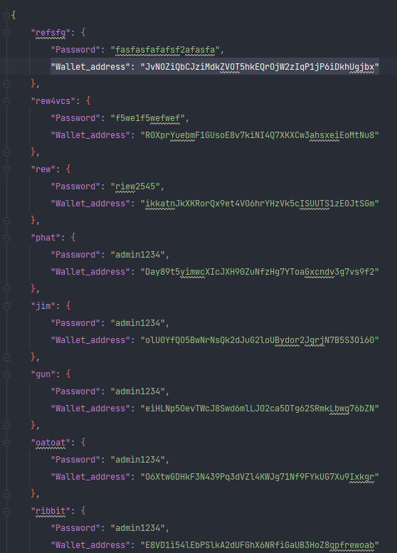

# META RABBIT WALLET

### Overview

Meta rabbit wallet is a digital wallet so that it can keep , transfer , withdraw , deposit your money and the last
feature, so We would like to offer cryptocurrency token storage and also some token trading. This project is inspired by
meta mask crypto wallet.

### Requirement

• __Required__ libraries and tools are `screen`, `turtle`, `json` , `csv` and `random`.

### Logo

 

### Program design

• 5 classes

1. Class `Account` so that it has attribute  __`username`__ , __`password`__ , __`address`__ that it can keep data of
   account so that thing brings you to your wallet by using address as an intermediary between user account with user of
   wallet

2. Class __`my_wallet`__ so that it has attribute __`your_address`__ ,__`balance`__ , __`all_token`__
   that it can create object by use data from file account , wallet access to object by it will edit your data wallet
   through your address of data account and address of data wallet

3. Class __`Token`__ so that it has attribute __`token_name`__ , __`amount`__ ,__`price`__ that it can use change data
   object of class token so that bring keep in dict of my_token so that it is attributed of class my_wallet and record
   wallet in json file

4. Class __`Obj`__ so that it has attribute __`painter`__ , __`screen`__ , __`pencil`__ The main property of this class
   is to draw images or text that and store those as methods of the class to use in class super_run , which will show
   the screen display.

5. Class __`Super_run`__ so that it has attribute __`username`__ , __`password`__ , __`your_screen`__ , __`party_dict`__
   ,
   __`super_run`__ , __`obj`__ , __`obj_2`__ , __`obj_3`__ and __`pencil`__ for this purpose, This class has the
   property of bringing other classes together to make a display.

### Code structure

• 3 files, 2 files are json and the last one is csv

1. `data_wallet.json` file that store dict and keep address of your wallet which are key , balance ,and type of tokens
   that you have.

   

2. `data_account.json` file that store dict and keep username password and address for using access to your wallet by
   access through your address and go to your wallet

   

3. `address_token.csv` This file will store data of various tokens such as price, contract, token name, which are real
   data. *In the price section, the current price is not used. But in the future there are plans I want to make the
   price of the coin based on the real time price at that time.

   

### Show Display Screen
`Login / Register  Screen `

admin

